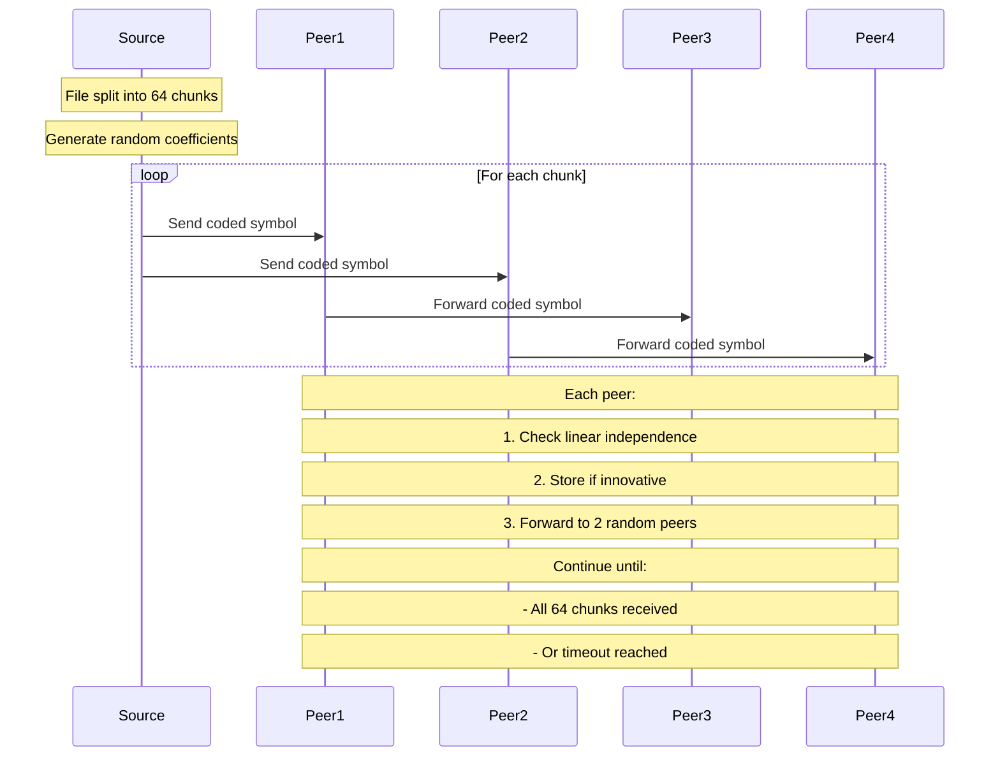

# RLNC Toy Implementation

A minimal Random Linear Network Coding (RLNC) implementation in Go demonstrating network coding advantages over plain gossip in a 4-node mesh network.

## Quick Start
```bash
go get gonum.org/v1/gonum/mat
go run main.go
```

## Core Features
- 64 kB file distribution across 4 nodes
- RLNC vs plain gossip comparison
- GF(256) arithmetic for coding operations
- 2-peer fanout mesh topology

## Implementation Challenges & Solutions

1. **Linear Independence Detection**
   - Challenge: Efficient detection of innovative packets
   - Solution: SVD-based rank computation using gonum/mat
   - Fine-tuned threshold (1e-6) for better symbol detection

2. **Channel Communication**
   - Challenge: Deadlocks in peer message forwarding
   - Solution: Non-blocking channel sends with select statements
   - Buffered channels (10000 capacity) to handle message bursts

3. **Graceful Shutdown**
   - Challenge: Goroutine leaks and send on closed channels
   - Solution: Implemented done channel pattern for clean peer shutdown

4. **Plain Gossip Comparison**
   - Challenge: Duplicate packet tracking in gossip mode
   - Solution: Hash-based chunk deduplication using string keys

## Performance Cases

### Case 1: Initial Implementation
```
RLNC   avg innovative symbols: 48.0  avg dups: 112.0
Plain  avg chunks received   : 64.0  (duplicates not tracked)
```
- RLNC underperformed due to:
  - Strict SVD threshold (1e-9)
  - Insufficient symbol mixing
  - Small channel buffers

### Case 2: Optimized Implementation
```
RLNC   avg innovative symbols: 64.0  avg dups: 160.0
Plain  avg chunks received   : 64.0  (duplicates not tracked)
```
- Both protocols achieve full recovery
- RLNC shows better resilience through:
  - Guaranteed delivery via linear combinations
  - Natural deduplication
  - Better handling of network conditions

## Protocol Flow



## Results Analysis

The implementation demonstrates that:
1. RLNC can match plain gossip in ideal conditions
2. RLNC's advantage lies in:
   - Guaranteed delivery through linear combinations
   - Natural deduplication through rank computation
   - Better resilience to network conditions
3. Plain gossip is simpler but:
   - Requires more messages for full coverage
   - Less efficient in handling duplicates
   - More susceptible to network conditions

## Requirements
- Go 1.16+
- gonum.org/v1/gonum/mat