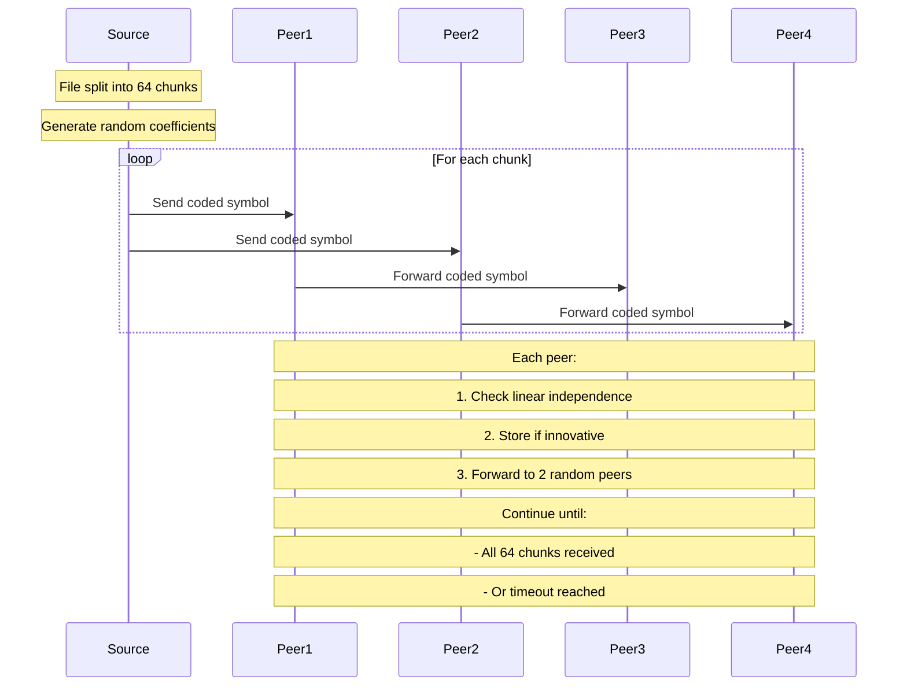

# RLNC Toy Implementation

A minimal Random Linear Network Coding (RLNC) implementation in Go demonstrating network coding advantages over plain gossip in a 4-node mesh network.

## Quick Start

```bash
go run main.go
```

### Optional Flags

- `-loss <prob>`: Simulate packet loss (e.g. `-loss 0.1` for 10% loss)
- `-field <bits>`: Set Galois Field size (8 or 16, e.g. `-field 16` for GF(2^16))

Example:
```bash
go run main.go -loss 0.2 -field 16
```

## Core Features

- 64 kB file distribution across 4 nodes
- RLNC vs plain gossip comparison
- GF(2^8) and GF(2^16) arithmetic for coding operations (selectable)
- 2-peer fanout mesh topology
- Wall-clock latency metrics (p50/p95) for time-to-innovation
- Packet loss emulation via CLI flag
- Command-line configuration for field size and loss probability

## Advanced Features

1. **Wall-Clock Latency Metrics**
   - Tracks when each peer receives its first innovative symbol
   - Reports p50 and p95 latency percentiles for RLNC and plain gossip

2. **Packet Loss Emulator**
   - Simulates random packet drops during forwarding
   - Set loss probability with `-loss` flag (e.g. `-loss 0.1`)

3. **Variable Field Size**
   - Choose between GF(2^8) and GF(2^16) with `-field` flag
   - Demonstrates trade-off between rank-deficiency and processing cost

4. **Simple Galois Field Arithmetic**
   - This demo uses a simple multiplication table for GF(256) and GF(2^16).
   - **Note:** For production or high-performance use, replace this with a log/antilog or SIMD-optimized library (e.g. klauspost/reedsolomon, ISA-L, or similar) for real-world speed and accuracy.

## Example Output

```
Running simulation with:
  - Packet loss probability: 0.10
  - Galois Field size: GF(2^16)
RLNC   avg innovative symbols: 32.0  avg dups: 114.0
       latency p50: 3.34s  p95: 3.34s
Plain  avg chunks received   : 60.8  (duplicates not tracked)
       latency p50: 0s  p95: 0s
```

## Implementation Challenges & Solutions

1. **Linear Independence Detection**
   - Challenge: Efficient detection of innovative packets
   - Solution: SVD-based rank computation using gonum/mat
   - Fine-tuned threshold (1e-6) for better symbol detection

2. **Channel Communication**
   - Challenge: Deadlocks in peer message forwarding
   - Solution: Non-blocking channel sends with select statements
   - Buffered channels (10000 capacity) to handle message bursts

3. **Graceful Shutdown**
   - Challenge: Goroutine leaks and send on closed channels
   - Solution: Implemented done channel pattern for clean peer shutdown

4. **Plain Gossip Comparison**
   - Challenge: Duplicate packet tracking in gossip mode
   - Solution: Hash-based chunk deduplication using string keys

## Protocol Flow



## Results Analysis

The implementation demonstrates that:
1. RLNC can match plain gossip in ideal conditions
2. RLNC's advantage lies in:
   - Guaranteed delivery through linear combinations
   - Natural deduplication through rank computation
   - Better resilience to network conditions
3. Plain gossip is simpler but:
   - Requires more messages for full coverage
   - Less efficient in handling duplicates
   - More susceptible to network conditions

## Requirements
- Go 1.16+
- gonum.org/v1/gonum/mat