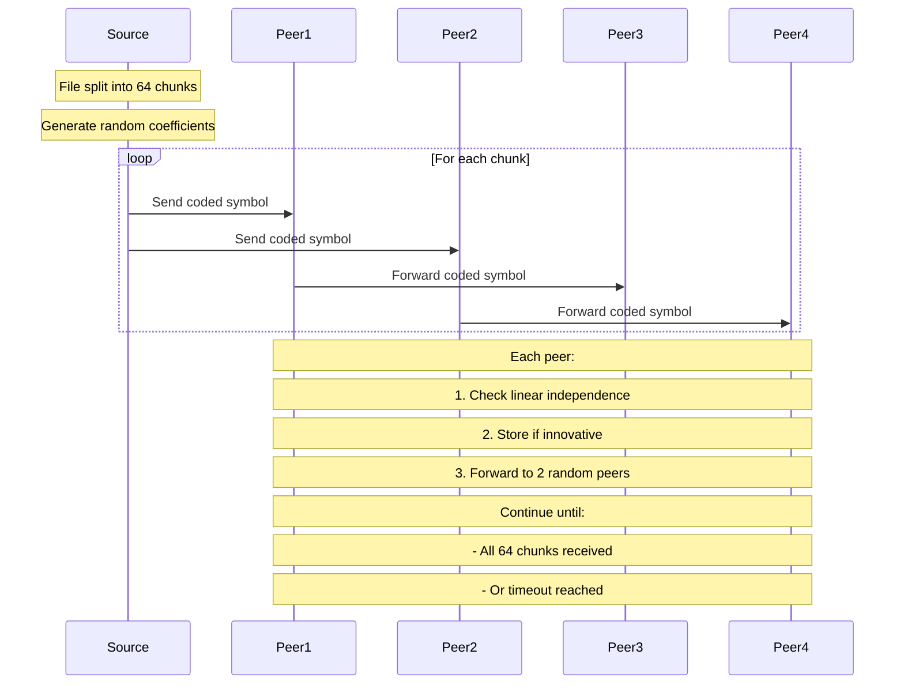

# RLNC Toy Implementation

A minimal Random Linear Network Coding (RLNC) implementation in Go demonstrating network coding advantages over plain gossip and Reed-Solomon in a 4-node mesh network.

## Quick Start

```bash
go run main.go
```

### Optional Flags

- `-loss <prob>`: Simulate packet loss (e.g. `-loss 0.1` for 10% loss)
- `-field <bits>`: Set Galois Field size (8 or 16, e.g. `-field 16` for GF(2^16))
- `-code <rlnc|rs|plain>`: Choose RLNC (default), Reed-Solomon (RS), or plain gossip
- `-compare`: Run RLNC, RS, and plain gossip and print a markdown table comparison
- `-multihop`: Run a multi-hop chain simulation for RLNC and RS
- `-hops <N>`: Number of hops for multi-hop simulation (default: 3)

Example:
```bash
go run main.go -loss 0.2 -compare
```

## Multi-Hop Recoding Demo

You can directly demonstrate RLNC's recoding advantage in multi-hop networks with:

```bash
go run main.go -multihop -hops 3 -loss 0.1
```

**Example output:**
```
Multi-hop simulation: 3 hops, loss per hop: 0.10
RLNC innovative at destination: 128/64
RS innovative at destination:   90/64
```

### What does this show?
- **RLNC**: Recoding at each hop "refreshes" redundancy, so only the worst single-hop loss matters. Even with multiple lossy hops, RLNC delivers all needed symbols (and more) to the destination.
- **RS**: All redundancy is added at the source, and losses accumulate at each hop. The destination may not receive enough unique blocks to decode, even with high up-front redundancy.

**Bottom line:** RLNC is uniquely robust for modular, multi-hop, or decentralized networks—recoding at each hop prevents cumulative loss and ensures high throughput.

## RLNC vs Reed-Solomon vs Plain Gossip Comparison

You can directly compare RLNC, RS, and plain gossip performance with the `-compare` flag. This runs all three schemes under the same simulated network conditions and prints a markdown table:

```
go run main.go -loss 0.2 -compare

| Scheme | Avg Innovative | Avg Dups | Latency p50 | Latency p95 |
|--------|----------------|----------|-------------|-------------|
| RLNC   | 64.0           | 108.2    | 964.875µs   | 1.003416ms  |
| RS     | 99.2           | 0.0      | 14.667µs    | 15.167µs    |
| Plain  | 48.0           |    -     | 0s          | 0s          |
```

### What Does Each Mode Demonstrate?
- **RLNC**: Robust to loss and duplication, recovers with high probability, but may receive many duplicate (non-innovative) symbols. Best for lossy, distributed, or peer-to-peer networks.
- **RS**: Classic erasure coding, efficient if all unique blocks are received, but not robust to loss or duplication in a network. Best for point-to-point or storage scenarios.
- **Plain**: Simple gossip/broadcast, no coding, just forwards chunks. Susceptible to loss and duplicates, and less efficient in large or lossy networks.

### What Do the Metrics Mean?
- **Avg Innovative**: Number of unique (innovative) symbols/blocks received per peer.
- **Avg Dups**: Number of duplicate (non-innovative) symbols/blocks received per peer (not tracked for plain gossip).
- **Latency p50/p95**: Median and 95th percentile time to receive the first innovative symbol/block.

#### Why is RLNC's Duplicate Count Higher?
- RLNC uses random mixing and forwarding, so peers often receive many non-innovative (duplicate) symbols before collecting enough innovative ones to decode. This is a trade-off for robustness and flexibility in lossy, distributed networks.
- RS forwards only unique blocks, so duplicates are almost always zero. However, if a peer misses even a few unique blocks, it cannot decode—RS is less robust in lossy/distributed settings.
- Plain gossip does not track duplicates, but is generally less efficient and robust than RLNC.

#### Summary Table
| Scheme | Duplicates | Robustness to Loss | Decoding Flexibility | Use Case                  |
|--------|------------|--------------------|---------------------|---------------------------|
| RLNC   | High       | High               | High                | Distributed, lossy, P2P   |
| RS     | Low/Zero   | Low                | Low                 | Storage, point-to-point   |
| Plain  | -          | Low                | Low                 | Simple broadcast/gossip   |

**Bottom line:** RLNC is more robust and flexible in lossy or distributed networks, at the cost of more duplicates. RS is bandwidth-efficient but less robust in such environments. Plain gossip is simplest, but least robust and efficient.

## Core Features

- 64 kB file distribution across 4 nodes
- RLNC vs plain gossip and RS comparison
- GF(2^8) and GF(2^16) arithmetic for coding operations (selectable)
- 2-peer fanout mesh topology
- Wall-clock latency metrics (p50/p95) for time-to-innovation
- Packet loss emulation via CLI flag
- Command-line configuration for field size and loss probability

## Advanced Features

1. **Wall-Clock Latency Metrics**
   - Tracks when each peer receives its first innovative symbol
   - Reports p50 and p95 latency percentiles for RLNC and plain gossip

2. **Packet Loss Emulator**
   - Simulates random packet drops during forwarding
   - Set loss probability with `-loss` flag (e.g. `-loss 0.1`)

3. **Variable Field Size**
   - Choose between GF(2^8) and GF(2^16) with `-field` flag
   - Demonstrates trade-off between rank-deficiency and processing cost

4. **Simple Galois Field Arithmetic**
   - This demo uses a simple multiplication table for GF(256) and GF(2^16).
   - **Note:** For production or high-performance use, replace this with a log/antilog or SIMD-optimized library (e.g. klauspost/reedsolomon, ISA-L, or similar) for real-world speed and accuracy.

## Example Output

```
Running simulation with:
  - Packet loss probability: 0.10
  - Galois Field size: GF(2^16)
RLNC   avg innovative symbols: 32.0  avg dups: 114.0
       latency p50: 3.34s  p95: 3.34s
Plain  avg chunks received   : 60.8  (duplicates not tracked)
       latency p50: 0s  p95: 0s
```

## Implementation Challenges & Solutions

1. **Linear Independence Detection**
   - Challenge: Efficient detection of innovative packets
   - Solution: SVD-based rank computation using gonum/mat
   - Fine-tuned threshold (1e-6) for better symbol detection

2. **Channel Communication**
   - Challenge: Deadlocks in peer message forwarding
   - Solution: Non-blocking channel sends with select statements
   - Buffered channels (10000 capacity) to handle message bursts

3. **Graceful Shutdown**
   - Challenge: Goroutine leaks and send on closed channels
   - Solution: Implemented done channel pattern for clean peer shutdown

4. **Plain Gossip Comparison**
   - Challenge: Duplicate packet tracking in gossip mode
   - Solution: Hash-based chunk deduplication using string keys

## Protocol Flow



## Results Analysis

The implementation demonstrates that:
1. RLNC can match plain gossip in ideal conditions
2. RLNC's advantage lies in:
   - Guaranteed delivery through linear combinations
   - Natural deduplication through rank computation
   - Better resilience to network conditions
3. Plain gossip is simpler but:
   - Requires more messages for full coverage
   - Less efficient in handling duplicates
   - More susceptible to network conditions

## Requirements
- Go 1.16+
- gonum.org/v1/gonum/mat