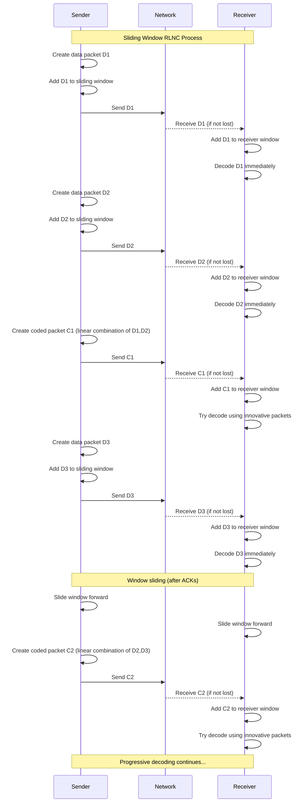

# Sliding Window RLNC Demo

A demonstration of Sliding Window Random Linear Network Coding (RLNC) showing its advantages over traditional block-based RLNC for low-latency, in-order delivery in lossy networks.

## What is Sliding Window RLNC?

Sliding Window RLNC combines the benefits of Random Linear Network Coding with sliding window protocols to achieve:
- **Lower in-order delivery delay** compared to block-based RLNC
- **Dynamic adaptation** to network conditions
- **Systematic coding** (mix of data and coded packets)
- **No blocking delay** - packets can be decoded as soon as sufficient innovative symbols are received

## Sequence Diagram



## Key Code Components

### 1. **Sliding Window Management** (The Core Magic)

```go
// SlidingWindow represents the sliding window for RLNC
type SlidingWindow struct {
    packets []*Packet
    base    int // Base of the window
    size    int
    mu      sync.Mutex
}

func (sw *SlidingWindow) AddPacket(pkt *Packet) {
    sw.mu.Lock()
    defer sw.mu.Unlock()
    
    // Add packet to window
    sw.packets = append(sw.packets, pkt)
    
    // Slide window if we have too many packets
    if len(sw.packets) > sw.size*2 {
        sw.packets = sw.packets[1:]
        sw.base++
    }
}

func (sw *SlidingWindow) SlideWindow(ackCount int) {
    sw.mu.Lock()
    defer sw.mu.Unlock()
    
    if ackCount > 0 && len(sw.packets) >= ackCount {
        sw.packets = sw.packets[ackCount:]
        sw.base += ackCount
    }
}
```

**Magic**: The window automatically slides forward as acknowledgments arrive, ensuring only recent packets are used for coding.

### 2. **Systematic Coding** (Data + Coded Packets)

```go
func (s *Sender) CreateCodedPacket() *Packet {
    windowPackets := s.window.GetWindowPackets()
    if len(windowPackets) == 0 {
        return nil
    }
    
    // Generate random coefficients
    coeffs := make([]byte, len(windowPackets))
    for i := range coeffs {
        coeffs[i] = byte(rand.Intn(fieldSize))
    }
    
    // Create linear combination
    codedData := make([]byte, chunkSize)
    for i, pkt := range windowPackets {
        if coeffs[i] != 0 {
            for j := range codedData {
                codedData[j] ^= s.gf.Mul(pkt.Data[j], coeffs[i])
            }
        }
    }
    
    return &Packet{
        ID:       s.packetID,
        Data:     codedData,
        Coeffs:   coeffs,
        IsCoded:  true,
        Timestamp: time.Now(),
    }
}
```

**Magic**: Creates linear combinations of packets in the current window using random coefficients in GF(256).

### 3. **Progressive Decoding** (No Blocking Delay)

```go
func (r *Receiver) ReceivePacket(pkt *Packet) bool {
    r.window.AddPacket(pkt)
    
    if pkt.IsCoded {
        return r.tryDecode()
    } else {
        // Data packet received directly - decode immediately!
        r.mu.Lock()
        r.decoded[pkt.ID] = pkt
        r.delays = append(r.delays, time.Since(pkt.Timestamp))
        r.mu.Unlock()
        return true
    }
}

func (r *Receiver) tryDecode() bool {
    windowPackets := r.window.GetWindowPackets()
    if len(windowPackets) < 2 {
        return false
    }
    
    // Try to decode using received packets
    innovative := r.findInnovativePackets(windowPackets)
    if len(innovative) >= len(r.decoded) {
        // We have enough innovative packets to decode
        for _, pkt := range innovative {
            if !pkt.IsCoded {
                r.mu.Lock()
                r.decoded[pkt.ID] = pkt
                r.delays = append(r.delays, time.Since(pkt.Timestamp))
                r.mu.Unlock()
            }
        }
        return true
    }
    return false
}
```

**Magic**: Data packets are decoded immediately, while coded packets enable progressive decoding as soon as sufficient innovative symbols are available.

### 4. **Main Simulation Loop** (Orchestrating the Magic)

```go
func simulateSlidingWindowRLNC(lossProb, codingRate float64) (int, float64) {
    sender := NewSender(windowSize, codingRate)
    receiver := NewReceiver(windowSize)
    
    // Simulate transmission
    for i := 0; i < totalPackets; i++ {
        // Send data packet
        dataPkt := sender.CreateDataPacket()
        if rand.Float64() >= lossProb {
            receiver.ReceivePacket(dataPkt)
        }
        
        // Send coded packet based on coding rate
        if rand.Float64() < codingRate {
            codedPkt := sender.CreateCodedPacket()
            if codedPkt != nil && rand.Float64() >= lossProb {
                receiver.ReceivePacket(codedPkt)
            }
        }
        
        // Simulate ACK and window sliding
        if i%windowSize == 0 && i > 0 {
            sender.window.SlideWindow(windowSize / 2)
        }
    }
    
    return receiver.GetStats()
}
```

**Magic**: This loop orchestrates the entire process - creating packets, simulating network conditions, and managing window sliding.

## Key Concepts

### 1. **Sliding Window Management**
- Maintains a window of unacknowledged packets
- Window slides forward as acknowledgments arrive
- Only packets in the current window are used for coding

### 2. **Systematic Coding**
- Sends both original data packets and coded packets
- Coding rate determines the ratio of coded to data packets
- Allows immediate decoding of data packets when received directly

### 3. **Dynamic Adaptation**
- Window size can be adjusted based on network conditions
- Coding rate can be modified to balance reliability vs overhead
- No need to wait for complete blocks before transmission

## Quick Start

```bash
cd sliding-window-demo
go run main.go
```

### Optional Flags

- `-loss <prob>`: Packet loss probability (default: 0.1)
- `-rate <rate>`: Coding rate - ratio of coded packets (default: 0.5)
- `-block <size>`: Block size for comparison (default: 8)
- `-compare`: Compare sliding window vs block-based RLNC

### Examples

```bash
# Basic sliding window simulation
go run main.go -loss 0.2 -rate 0.6

# Compare with block-based RLNC
go run main.go -compare -loss 0.15

# High loss scenario
go run main.go -loss 0.3 -rate 0.7 -compare
```

## Example Output

```
Sliding Window vs Block-based RLNC (Loss: 20.0%, Coding Rate: 0.5)
┌─────────────────┬──────────────────┬─────────────────┐
│ Scheme          │ Packets Received │ Avg Delay (μs)  │
├─────────────────┼──────────────────┼─────────────────┤
│ Sliding Window  │               49 │             6.6 │
│ Block-based     │               13 │            60.8 │
└─────────────────┴──────────────────┴─────────────────┘

Key Results:
• Delay reduction: 89.1%
• Throughput improvement: 276.9%
```

## How It Works

### 1. **Sender Side**
- Creates data packets and adds them to the sliding window
- Generates coded packets as linear combinations of packets in the current window
- Slides the window forward as acknowledgments arrive

### 2. **Receiver Side**
- Receives both data and coded packets
- Maintains its own sliding window of received packets
- Attempts to decode as soon as sufficient innovative symbols are available
- Tracks delivery delays for performance measurement

### 3. **Coding Process**
- Uses GF(256) arithmetic for linear combinations
- Random coefficients ensure high probability of innovative symbols
- Systematic approach allows immediate use of data packets

## Advantages Over Block-Based RLNC

1. **Lower Latency**: No need to wait for complete blocks
2. **Better Adaptation**: Window size can be adjusted dynamically
3. **In-Order Delivery**: Packets can be delivered as soon as decoded
4. **Reduced Memory**: Only maintains window-sized buffer instead of full block

## Use Cases

- **Real-time streaming** where low latency is critical
- **High bandwidth-delay product networks**
- **Lossy wireless networks**
- **Industrial IoT applications**
- **6G communication systems**

## Implementation Details

- **Window Size**: Configurable sliding window (default: 8 packets)
- **Coding Rate**: Ratio of coded packets to data packets
- **Galois Field**: GF(256) for efficient arithmetic
- **Innovation Check**: Simple duplicate detection (can be enhanced with matrix rank)

## Future Enhancements

- **Reinforcement Learning**: Dynamic window size adjustment
- **TCP Integration**: Decoupled sliding window from TCP flow control
- **Advanced Decoding**: Matrix-based innovation detection
- **Performance Metrics**: Goodput, complexity analysis 